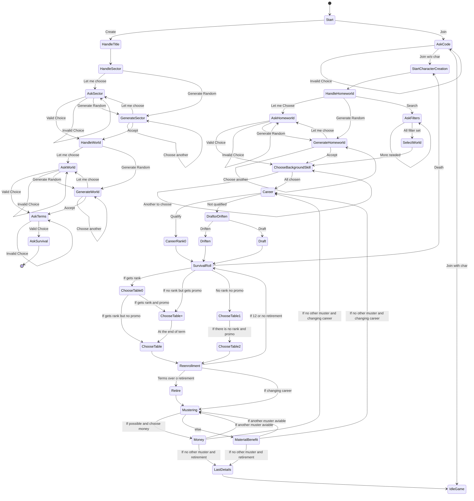

```mermaid
stateDiagram-v2
    [*] --> Start
    Start --> HandleTitle : Create
    Start --> AskCode : Join
    HandleTitle --> HandleSector
    AskCode --> AskCode: Invalid Choice
    AskCode --> StartCharacterCreation: Join w/o char
    AskCode --> IdleGame: Join with char
    
    HandleSector --> AskSector: Let me choose
    HandleSector --> GenerateSector: Generate Random
    AskSector --> HandleWorld: Valid Choice
    AskSector --> AskSector: Invalid Choice
    AskSector --> GenerateSector: Generate Random
    GenerateSector --> GenerateSector: Choose another
    GenerateSector --> AskSector: Let me choose
    GenerateSector --> HandleWorld: Accept
    
    HandleWorld --> AskWorld: Let me choose
    HandleWorld --> GenerateWorld: Generate Random
    AskWorld --> AskTerms: Valid Choice
    AskWorld --> AskWorld: Invalid Choice
    AskWorld --> GenerateWorld: Generate Random
    GenerateWorld --> GenerateWorld: Choose another
    GenerateWorld --> AskWorld: Let me choose
    GenerateWorld --> AskTerms: Accept
    
    AskTerms --> AskTerms: Invalid Choice
    AskTerms --> AskSurvival: Valid Choice
    
    AskSurvival --> [*]
    
    StartCharacterCreation --> HandleHomeworld
    HandleHomeworld --> AskHomeworld: Let me Choose
    HandleHomeworld --> GenerateHomeworld: Generate Random
    HandleHomeworld --> AskFilters: Search
    AskFilters --> AskFilters: More needed
    AskFilters --> SelectWorld: All filter set
    SelectWorld --> ChooseBackgroundSkill
    AskHomeworld --> ChooseBackgroundSkill: Valid Choice
    AskHomeworld --> AskHomeworld: Invalid Choice
    AskHomeworld --> GenerateHomeworld: Generate Random
    GenerateHomeworld --> GenerateHomeworld: Choose another
    GenerateHomeworld --> AskHomeworld: Let me choose
    GenerateHomeworld --> ChooseBackgroundSkill: Accept
    ChooseBackgroundSkill --> ChooseBackgroundSkill: Another to choose
    ChooseBackgroundSkill --> Career: All chosen
    Career --> CareerRank0: Qualify
    Career --> DraftorDriften: Not qualified
    DraftorDriften --> Driften: Driften
    DraftorDriften --> Draft: Draft
    
    CareerRank0 --> SurvivalRoll
    Driften --> SurvivalRoll
    Draft --> SurvivalRoll
    
    SurvivalRoll --> StartCharacterCreation: Death
    
    SurvivalRoll --> ChooseTable0: If gets rank
    SurvivalRoll --> ChooseTable+: If no rank but gets promo
    SurvivalRoll --> ChooseTable1: No rank no promo
    ChooseTable0 --> ChooseTable: If gets rank but no promo
    ChooseTable0 --> ChooseTable+: If gets rank and promo
    ChooseTable+ --> ChooseTable: At the end of term
    ChooseTable1 --> ChooseTable2: If there is no rank and promo
    ChooseTable2 --> Reenrollment
    ChooseTable --> Reenrollment
    Reenrollment --> SurvivalRoll: If 12 or no retirement
    Reenrollment --> Retire: Terms over o retirement
    Retire --> Mustering
    Reenrollment --> Mustering: If changing career
    Mustering --> Money: If possible and choose money
    Mustering --> MaterialBenefit: else
    Money --> Mustering: If another muster aviable
    MaterialBenefit --> Mustering: If another muster aviable
    Money --> Career: If no other muster and changing career
    MaterialBenefit --> Career: If no other muster and changing career
    Money --> LastDetails: If no other muster and retirement
    MaterialBenefit --> LastDetails: If no other muster and retirement
    LastDetails --> IdleGame
    
    
```