

    <h1 style="margin-bottom: 2px;">Traveller Telegram Bot</h1>
    <h3 style="margin: 0px; padding-top: 0px;">Simone Foderà, Michele Giornetta, Damiano Guida</h3>
    <h3 style="margin-top: 0px; padding-top: 0px;">Prof. Giovanni Agosta</h3>

## 1. Introduzione e obiettivi

Traveller è un gioco di ruolo da tavolo di fantascienza ideato da Marc Miller, Frank Chadwick, John Harshman and Loren Wiseman nel 1977. Da allora, ha goduto di diverse riedizioni, l'ultima delle quali nel 2022.

Il gioco, ambientato in un futuro remoto, offre un vasto universo a cui i giocatori possono prendere parte mediante esplorazioni spaziali, battaglie aeree e terrestri e commercio interstellare.

Traveller usa un sistema di risoluzione delle azioni basato su due dadi a sei facce (d6) per determinare il successo o il fallimento delle azioni svolte dai giocatori. In particolare si seguono i seguenti passi per ogni azione:
1) Si lanciano due d6 e si sommano i risultati
2) Si aggiungono eventuali modificatori
3) Se il risultato è uguale o maggiore a 8 l'azione è considerata un successo.

Fin dalla sua prima edizione, Traveller fu particolarmente apprezzato dalla critica per la grande attenzione ai dettagli posta nella stesura delle regole, nell'ambientazione ufficiale e nel rendere le avventure dei personaggi e la loro progressione credibile e innovativa.

Infatti, a differenza di altri giochi di ruolo come *Dungeons & Dragons*, in cui il processo di creazione dei personaggi è semplice, immediato e poco profondo, in Traveller viene introdotto per la prima volta un sistema per la generazione dei personaggi in cui ogni giocatore deve decidere le esperienze di vita del proprio personaggio fino al momento dell'inizio dell'avventura a cui esso prenderà parte, facendogli così ottenere abilità, soldi e equipaggiamenti da poter utilizzare durante quest'ultima.

Questo processo, a causa della moltitudine di scelte che è possibile intraprendere, può risultare lungo e dispendioso di tempo, e come questo anche molte altre funzionalità del gioco richiedono ai giocatori di eseguire diverse azioni a volte confusionarie e poco intuitive.

L'obiettivo del Progetto di Ingegneria Informatica proposto dal Prof. Agosta è quello di sviluppare uno strumento che possa aiutare i giocatori di Traveller a gestire le proprie avventure in modo più comodo e veloce rispetto ad un approccio analogico e manuale.

Questo strumento consiste in un ChatBot accessibile tramite la piattaforma di messaggistica istantanea Telegram, che possa gestire più utenti connessi contemporaneamente a più avventure, e che implementi le seguenti funzionalità:

- Creazione di avventure
- Creazione di personaggi
- Gestione 
- ...

## 2. Architettura software

Il software realizzato, sviluppato in Python, si interfaccia con diverse sorgenti dati:

1. Un Database *PostgreSQL* per gestire tutte le informazioni relative agli utenti, ai loro personaggi e alle loro avventure.

2. Diversi file *JSON* per gestire i 176 diversi equipaggiamenti presenti nel gioco e le decine di migliaia di pianeti esplorabili.

3. Dei file *Pickle* utilizzati per salvare i dati temporanei relativi alle conversazioni degli utenti con il bot, per permettergli di funzionare senza problemi anche in caso di crash o di spegnimento del server.

In particolare, tutti i dati relativi ai settori e pianeti esplorabili sono stati ricavati dall'API fornita da [TravellerMap](https://www.travellermap.com), e salvati poi in locale (dopo operazioni di manipolazione e pulizia dei dati) per fornire performance migliori agli utenti.

L'intero progetto è stato sviluppato facendo largo uso delle funzionalità di *OOP* e dei *type hints* forniti da Python, per rendere il codice più leggibile a chi volesse, eventualmente, ampliarne le funzionalità.

...

Oltre a ciò, la conversazione di ogni utente con il bot è stata trattata con una *Macchina a Stati Finiti*, anche grazie alle possibilità offerte dalla libreria [python-telegram-bot](https://github.com/python-telegram-bot/python-telegram-bot).

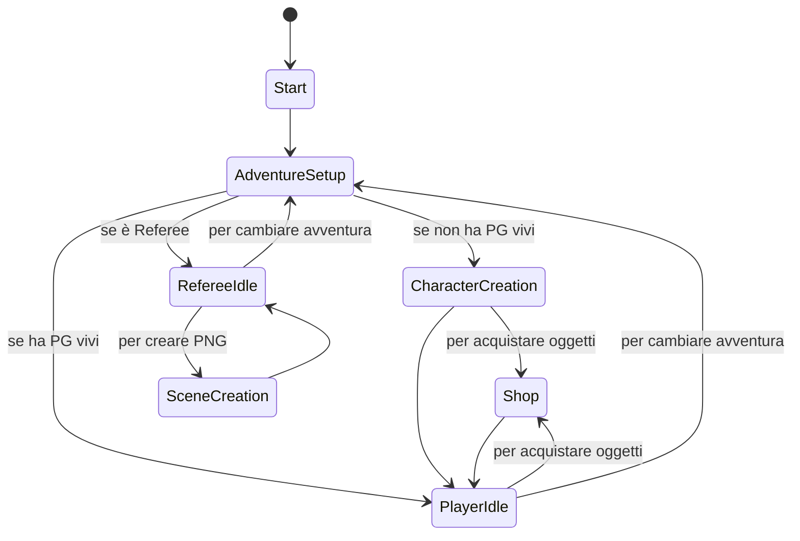
```mermaid
stateDiagram-v2

[*] --> Start

Start --> AdventureSetup

AdventureSetup --> RefereeIdle : se è Referee
AdventureSetup --> CharacterCreation : se non ha PG vivi
AdventureSetup --> PlayerIdle : se ha PG vivi

CharacterCreation --> Shop : per acquistare oggetti
CharacterCreation --> PlayerIdle

PlayerIdle --> Shop : per acquistare oggetti
Shop --> PlayerIdle 

RefereeIdle --> SceneCreation : per creare PNG
SceneCreation --> RefereeIdle

RefereeIdle --> AdventureSetup : per cambiare avventura
PlayerIdle --> AdventureSetup : per cambiare avventura
```

Ognuno di questi stati rappresenta una particolare conversazione che l'utente può avere con il bot, e anch'esse sono modellate con FSM che possono avere fino a decine di stati a loro volta (come nel caso della creazione dei personaggi).

...

## 3. Manuale Utente

All'avvio della conversazione con il bot, l'utente dovrà subito scegliere se creare una nuova avventura come *Referee* o se partecipare ad un'avventura creata da un altro giocatore.

### 3.1. Creare un'avventura

Durante la creazione di un'avventura, il giocatore dovrà specificare, mediante una procedura guidata, le seguenti caratteristiche :

- Titolo dell'avventura
- Settore e Pianeta di partenza
- Massimo numero di periodi (di 4 anni) che i personaggi potranno impiegare lavorando, prima di ritirarsi e iniziare l'avventura.
- Se il fallimento di un *Survival Roll* durante la fase di creazioni debba essere letale o meno.

    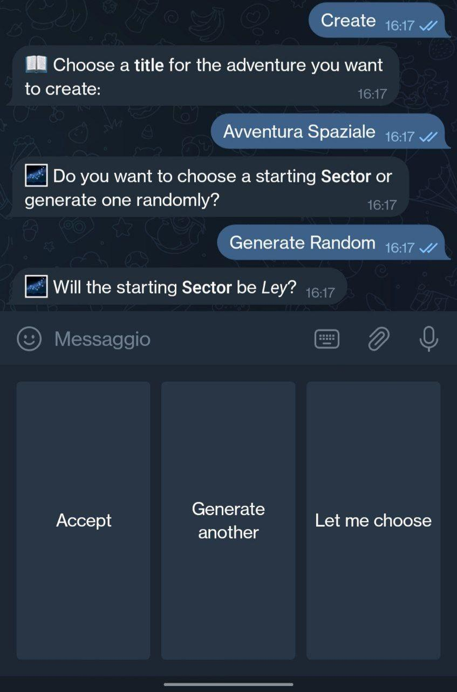
    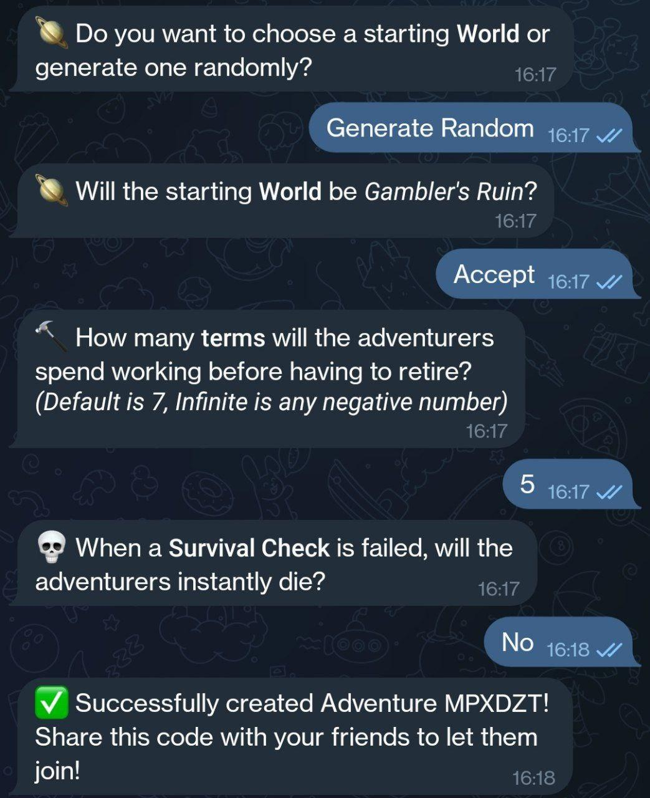

Dopo aver specificato tutte le caratteristiche richieste, l'avventura verrà creata e l'utente riceverà un codice di 6 cifre da condividere con i giocatori che intende far partecipare alla sua partita.

Da questo momento, può utilizzare i comandi specificati nella sezione `4.3.` per gestire l'avventura appena creata.

### 3.2. Creare un personaggio

Scegliendo invece l'opzione *Join* dopo aver avviato il bot, l'utente potrà scegliere se rientrare in avventure a cui aveva già partecipato in precedenza (sia come *Referee* che come *Player*) o se entrare a far parte di una nuova avventura, fornendo il relativo codice alfanumerico.

    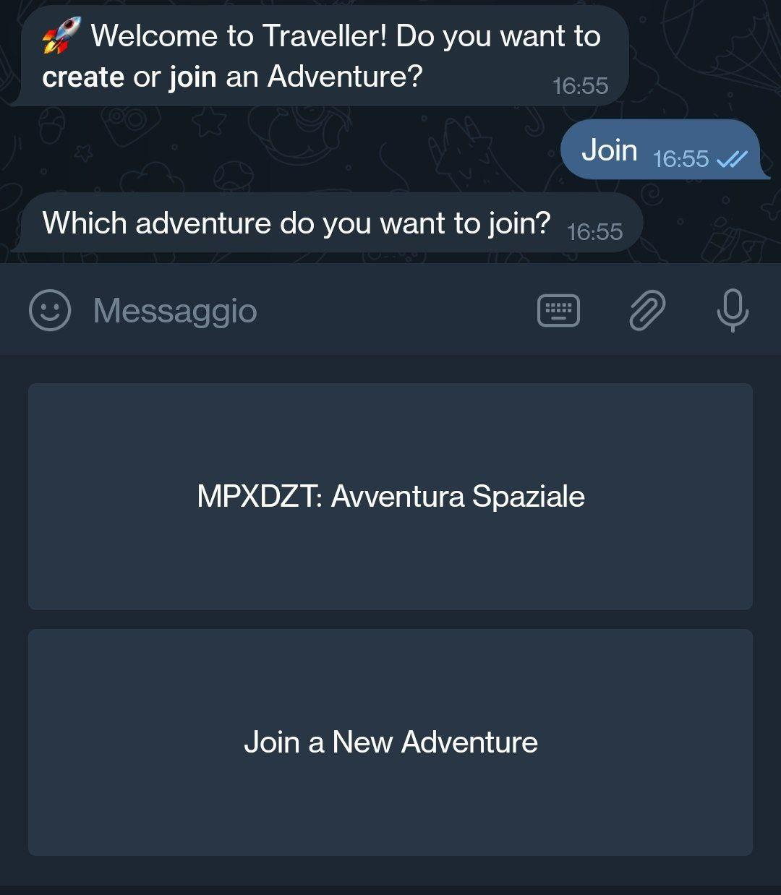
    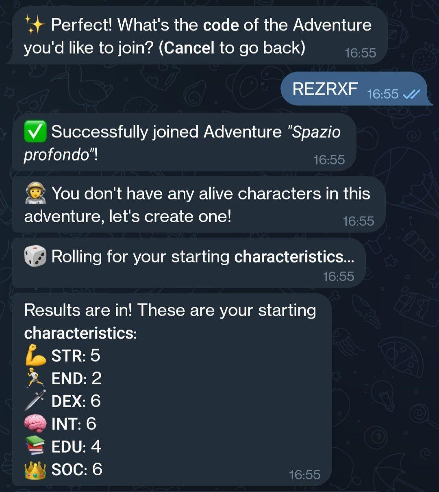

Dopo essere entrato in una nuova avventura per la prima volta, la procedura di creazione del personaggio avrà inizio.

Dopo aver ottenuto delle caratteristiche iniziali generate casualmente, l'utente dovrà scegliere il pianeta natale del proprio personaggio filtrando sulle caratteristiche principali che descrivono ogni pianeta nell'universo di Traveller.

La lista dei pianeti disponibili tra cui scegliere conterrà solo i pianeti presenti nel Settore iniziale determinato dal *Referee* dell'avventura.

    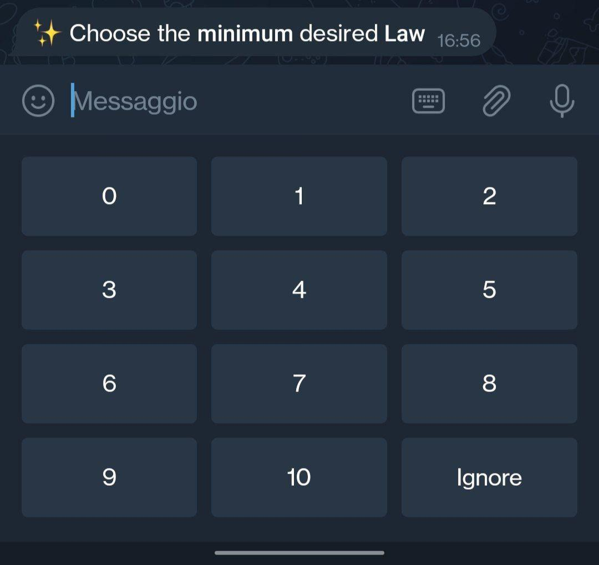
    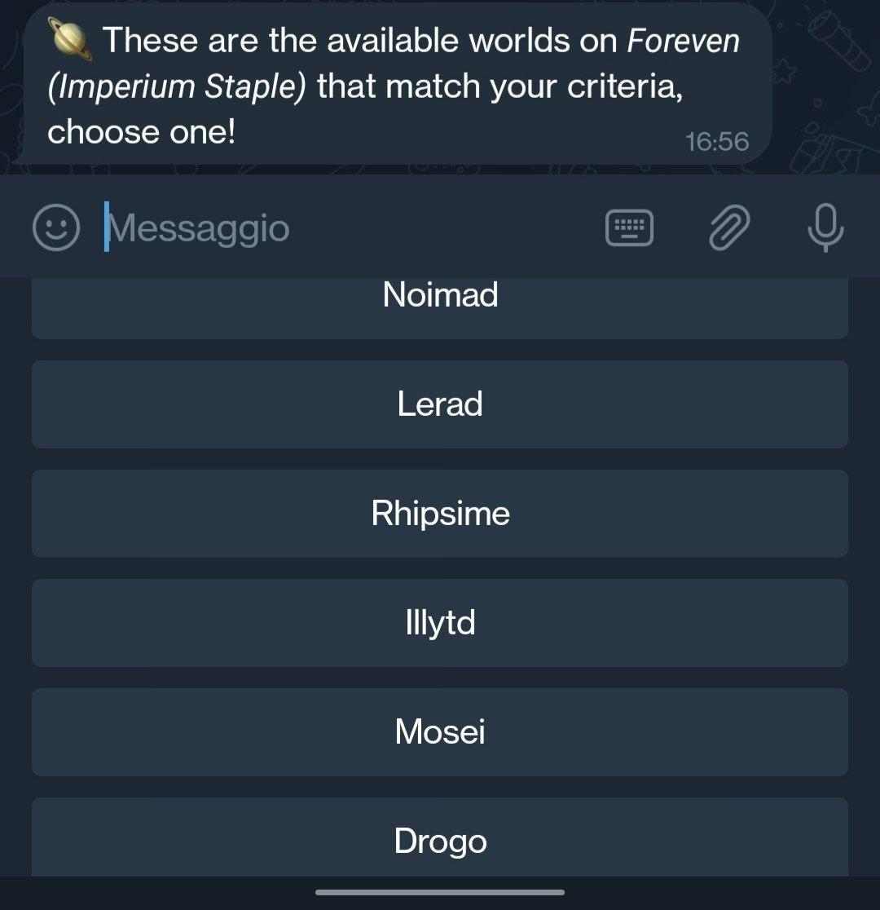

Dopo aver selezionato un pianeta d'origine, l'utente avrà la possibilità di scegliere alcune abilità iniziali da acquisire.

Dopodichè, dovrà scegliere tra le 24 carriere disponibili quale far intraprendere al proprio personaggio e, in caso di qualificazione, potrà scegliere delle abilità aggiuntive da acquisire.

Durante questa fase il giocatore dovrà agire in base ai risultati casuali calcolati dal Bot, che potrebbe far sì che il personaggio avanzi di grado nella sua carriera o addirittura far sì che muoia durante il servizio.

    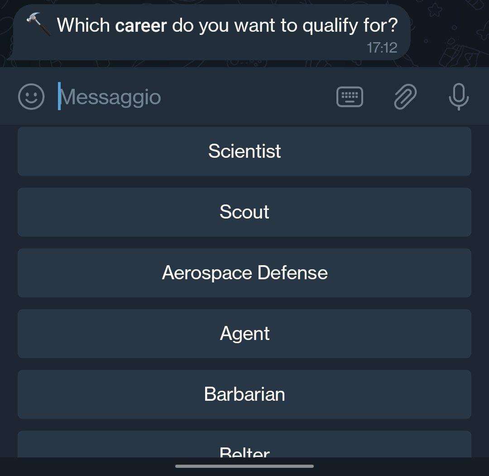
    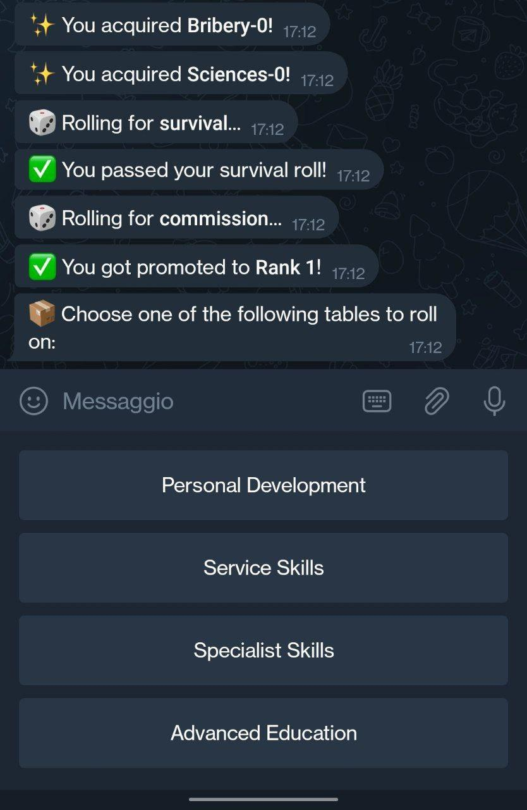
    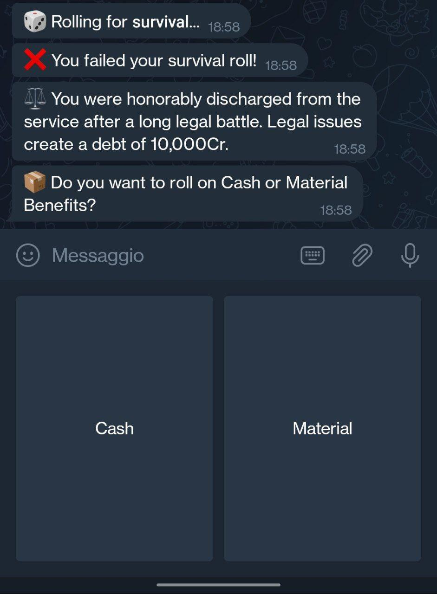

Ogni 4 anni i personaggi subiscono gli effetti dell'invecchiamento. Il giocatore può scegliere se far assumere droghe che impediscano al suo personaggio di subire danni.

Dopo aver aver ricevuto eventuali benefici (aumento di caratteristiche o abilità aggiuntive), il giocatore potrà scegliere se interrompere la creazione del personaggio o continuare per un termine aggiuntivo, continuando con la sua attuale carriera o eventualmente scegliendo un nuovo impiego per il suo personaggio.

Dopo essersi ritirato dall'attuale carriera, il giocatore può acquisire dei benefici legato al grado raggiunto in quest'ultima.

Infine, il giocatore potrà scegliere nome e sesso del proprio personaggio, e avrà la possibilità di riparare eventuali danni subiti durante la creazione, ripagare i suoi debiti e infine acquistare un equipaggiamento iniziale con i crediti guadagnati.

    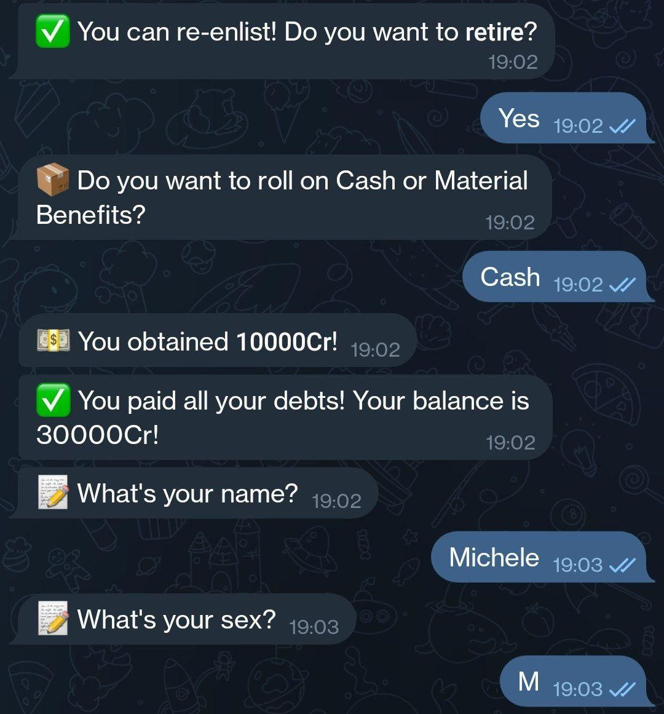
    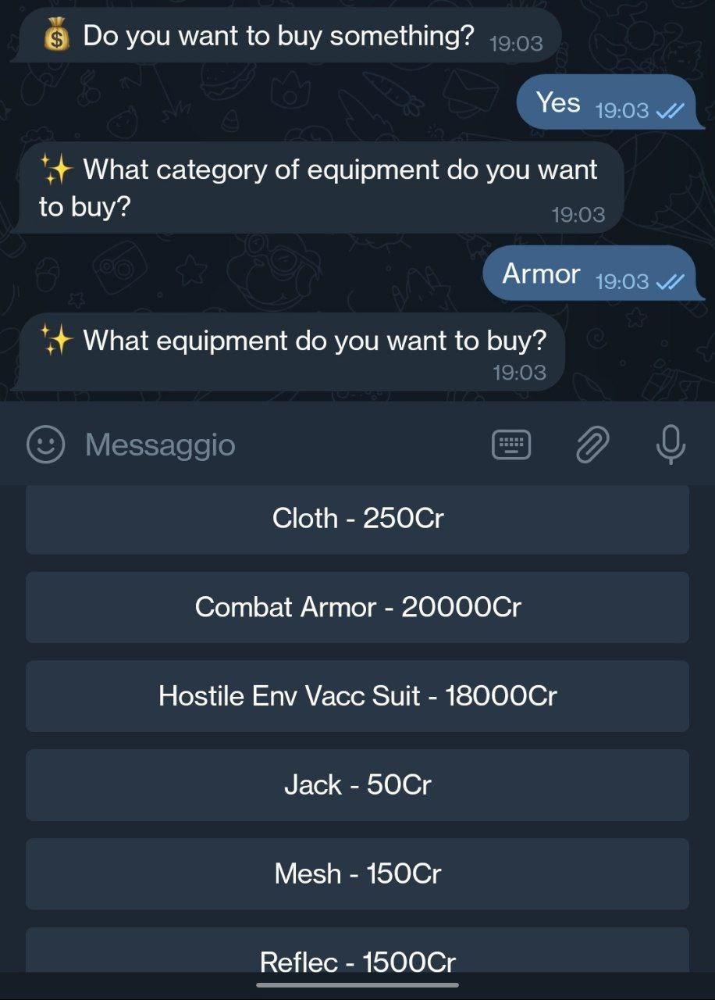

Da ora in poi, il giocatore potrà utilizzare il personaggio appena creato nell'avventura corrente.

### 3.3. Funzionalità del Referee

Il Referee potrà, tramite l'utilizzo di appositi comandi, avere controllo totale su ogni caratteristica dei personaggi che parteciperanno alla sua avventura.

Nello specifico, le funzionalità implementate sono:

1. Visualizzare informazioni sull'avventura corrente, sui personaggi, sui PNG presenti e sul pianeta in cui si trovano gli avventurieri, oltre ad una mappa dei pianeti circostanti.

    - `/info {<name>|world|map|scene|adventure}`

2. Modificare ogni caratteristica dei personaggi in modo permanentemente e non, alterarne gli status (radiazioni, fatica, ferite, etc.), i possedimenti monetari e aggiungere o rimuovere oggetti dai loro inventario.
    - `/set <name> {stat|mod|status|creds} <... fieldName> [{+|-}][<value>]`

3. Permettere ai personaggi di accedere a negozi personalizzati, specificando le tipologie di equipaggiamenti in vendita e il loro *Tech Level*.
    - `/shop open <... categories> [<tech_level>]`
    - `shop close`

4. Permettere ai personaggi di acquistare un'astronave condivisa per viaggiare tra pianeti, e eseguire per loro i viaggi.
    - `/starship`
    - `/travel <destination>`

5. Permettere agli avventurieri di riposare per brevi o lunghi periodi, così da modificarne le caratteristiche di conseguenza.
    - `/rest {short|long}`

6. Creare PNG (Personaggi Non Giocanti) alleati o nemici degli avventurieri, seguendo un procedimento simile a quello della Creazione dei Personaggi, ma più semplificato.
    - `/scene new`

    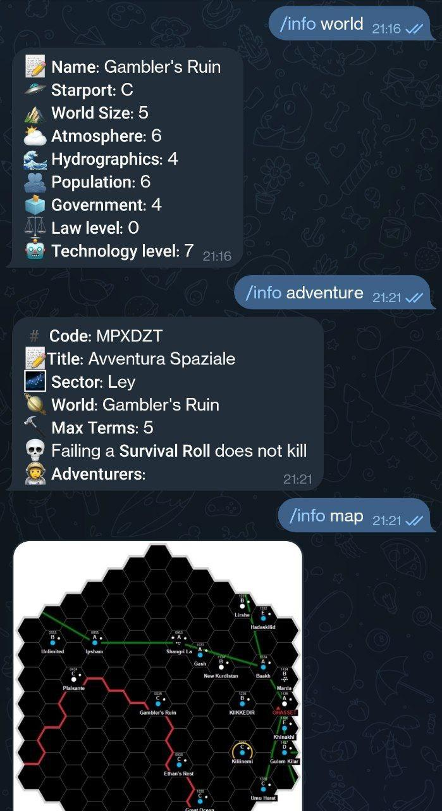
    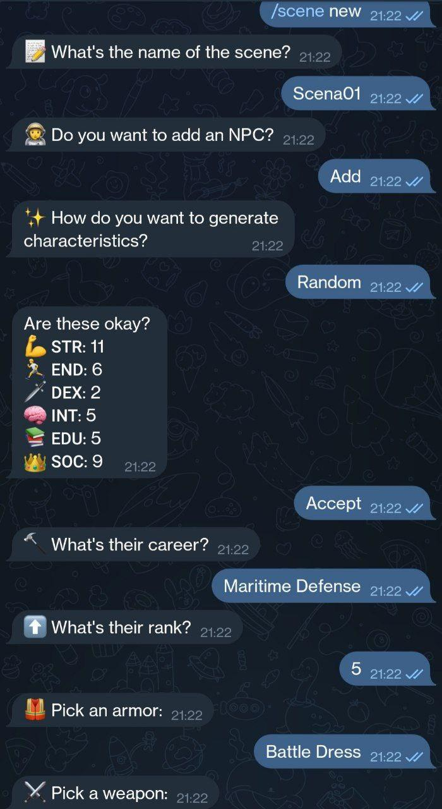

### 3.4. Funzionalità del Player

Il giocatore potrà svolgere le seguenti azioni:

1. Visualizzare informazioni sull'avventura corrente, sul suo personaggio, sui PNG presenti e sul pianeta in cui si trova, oltre ad una mappa dei pianeti circostanti.

2. Eseguire lanci di dadi e *Skill Check*, specificando abilità da utilizzare e difficoltà dell'azione.

3. Visualizzare il suo inventario e utilizzare/buttare i propri oggetti.

4. Acquistare oggetti da un negozio, se precedentemente attivato dal *Referee*.

    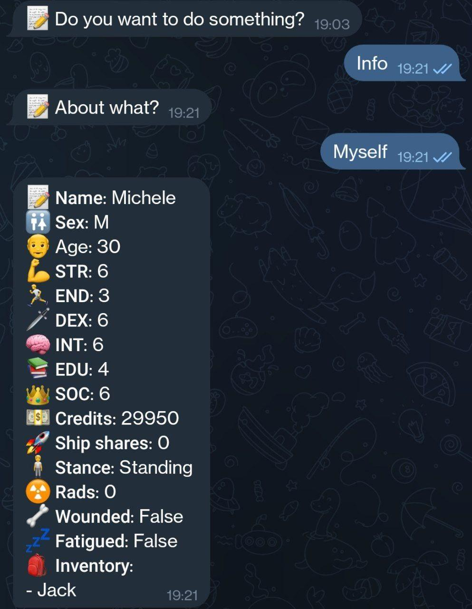
    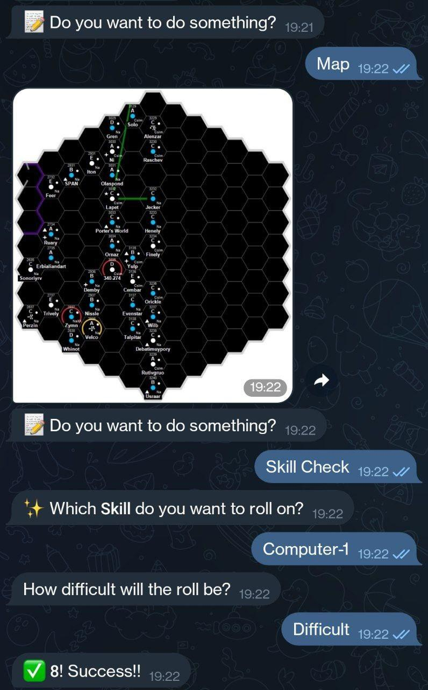

## 4. Conclusioni

Gli obiettivi prefissati sono stati raggiunti: gli utenti del bot possono quindi gestire e partecipare a avventure multiple, cambiando tra esse con comodità.
Il progetto è stato pensato ed implementato per rendere un'eventuale espansione il più agevole possibile. Alcune funzionalità presenti in Trvaeller che potrebbero essere aggiunte nei prossimi anni sono:
- Un sistema di assistenza alla gestione del combattimento
- L'aggiunta dei personaggi non umani nella selezione del personaggio
- L'aggiunta della caratteristica *PSIONICS*
...
