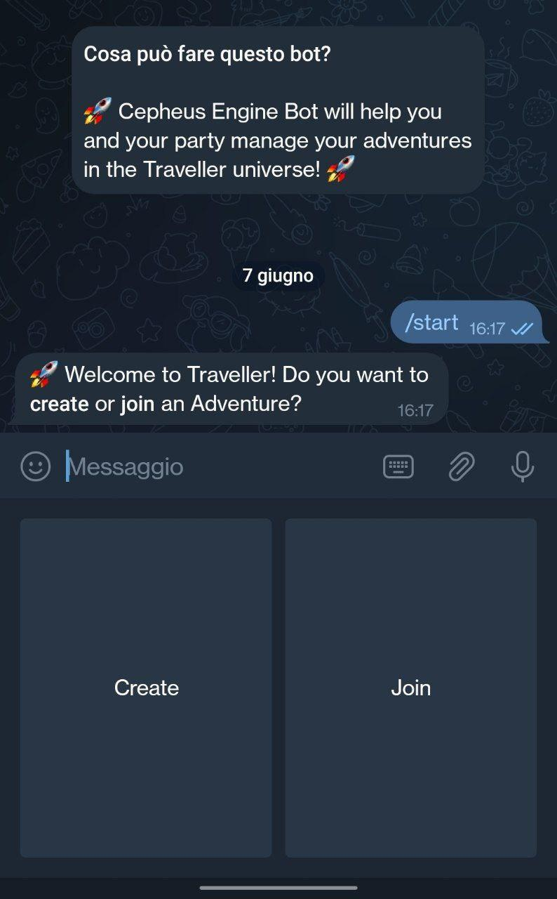

# Traveller Telegram Bot

## 1. Introduzione e obiettivi

Traveller è un gioco di ruolo da tavolo di fantascienza ideato da Marc Miller, Frank Chadwick, John Harshman and Loren Wiseman nel 1977. Da allora, ha goduto di diverse riedizioni, l'ultima delle quali nel 2017.

Il gioco, ambientato in un futuro remoto, offre un vasto universo a cui i giocatori possono prendere parte mediante esplorazioni spaziali, battaglie aeree e terrestri e commercio interstellare.

-- IMG

-- Altre descrizioni su come funziona

Fin dalla sua prima edizione, Traveller fu particolarmente apprezzato dalla critica per la grande attenzione ai dettagli posta nella stesura delle regole, nell'ambientazione ufficiale e nel rendere le avventure dei personaggi e la loro progressione credibile e innovativa.

Infatti, a differenza di altri giochi di ruolo come *Dungeons & Dragons*, in cui il processo di creazione dei personaggi è semplice, immediato e poco profondo, in Traveller viene introdotto per la prima volta un sistema per la generazione dei personaggi in cui ogni giocatore deve decidere le esperienze di vita del proprio personaggio fino al momento dell'inizio dell'avventura a cui esso prenderà parte, facendogli così ottenere abilità, soldi e equipaggiamenti da poter utilizzare durante quest'ultima.

Questo processo, a causa della moltitudine di scelte che è possibile intraprendere, può risultare molto lungo e dispendioso di tempo.

L'obiettivo del Progetto di Ingegneria Informatica proposto dal Prof. Agosta è quello di sviluppare uno strumento che possa aiutare i giocatori di Traveller a gestire le proprie avventure in modo più comodo e veloce rispetto ad un approccio analogico e manuale.

Questo strumento consiste in un ChatBot accessibile tramite la piattaforma di messaggistica istantanea Telegram, che implementi le seguenti funzionalità:

- Creazione di avventure
- Creazione di personaggi
- Gestione 
- ...

## 3. Architettura software

## 4. Manuale Utente

All'avvio della conversazione con il bot, l'utente dovrà subito scegliere se creare una nuova avventura come *Referee* o se partecipare ad un'avventura creata da un altro giocatore.

    

### 4.1. Creare un'avventura

Durante la creazione di un'avventura, il giocatore dovrà specificare, mediante una procedura guidata, le seguenti caratteristiche :

- Titolo dell'avventura
- Settore e Pianeta di partenza
- Massimo numero di periodi (di 4 anni) che i personaggi potranno impiegare lavorando, prima di ritirarsi e iniziare l'avventura.
- Se il fallimento di un *Survival Roll* durante la fase di creazioni debba essere letale o meno.

    
    

Dopo aver specificato tutte le caratteristiche richieste, l'avventura verrà creata e l'utente riceverà un codice di 6 cifre da condividere con i giocatori che intende far partecipare alla sua partita.

Da questo momento, può utilizzare i comandi specificati nella sezione `4.3.` per gestire l'avventura appena creata.

### 4.2. Creare un personaggio

Scegliendo invece l'opzione *Join* dopo aver avviato il bot, l'utente potrà scegliere se rientrare in avventure a cui aveva già partecipato in precedenza (sia come *Referee* che come *Player*) o se entrare a far parte di una nuova avventura, fornendo il relativo codice alfanumerico.

    
    

Dopo essere entrato in una nuova avventura per la prima volta, la procedura di creazione del personaggio avrà inizio.

Dopo aver ottenuto delle caratteristiche iniziali generate casualmente, l'utente dovrà scegliere il pianeta natale del proprio personaggio filtrando sulle caratteristiche principali che descrivono ogni pianeta nell'universo di Traveller.

La lista dei pianeti disponibili tra cui scegliere conterrà solo i pianeti presenti nel Settore iniziale determinato dal *Referee* dell'avventura.

    
    

Dopo aver selezionato un pianeta d'origine, l'utente avrà la possibilità di scegliere alcune abilità iniziali da acquisire.

Dopodichè, dovrà scegliere tra le 24 carriere disponibili quale far intraprendere al proprio personaggio e, in caso di qualificazione, potrà scegliere delle abilità aggiuntive da acquisire.

Durante questa fase il giocatore dovrà agire in base ai risultati casuali calcolati dal Bot, che potrebbe far sì che il personaggio avanzi di grado nella sua carriera o addirittura far sì che muoia durante il servizio.

    
    
    

Ogni 4 anni i personaggi subiscono gli effetti dell'invecchiamento. Il giocatore può scegliere se far assumere droghe che impediscano al suo personaggio di subire danni.

Dopo aver aver ricevuto eventuali benefici (aumento di caratteristiche o abilità aggiuntive), il giocatore potrà scegliere se interrompere la creazione del personaggio o continuare per un termine aggiuntivo, continuando con la sua attuale carriera o eventualmente scegliendo un nuovo impiego per il suo personaggio.

Dopo essersi ritirato dall'attuale carriera, il giocatore può acquisire dei benefici legato al grado raggiunto in quest'ultima.

Infine, il giocatore potrà scegliere nome e sesso del proprio personaggio, e avrà la possibilità di riparare eventuali danni subiti durante la creazione, ripagare i suoi debiti e infine acquistare un equipaggiamento iniziale con i crediti guadagnati.

    
    

Da ora in poi, il giocatore potrà utilizzare il personaggio appena creato nell'avventura corrente.

### 4.3. Funzionalità del Referee

### 4.4. Funzionalità del Player

## 5. Conclusioni

